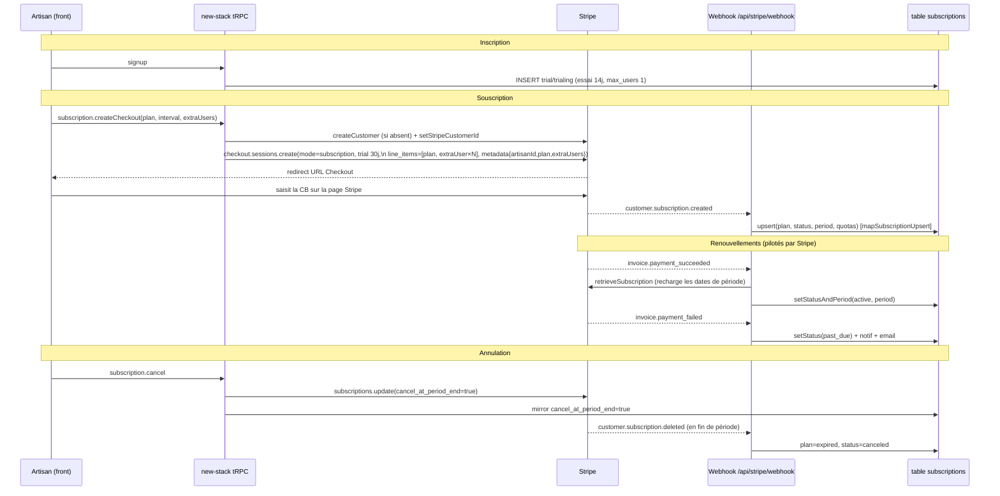

# OPE-300 — Cartographie du billing Stripe actuel (new-stack)

> Audit non bloquant. Cible : le **new-stack** (`src/`). Le legacy (`server/`) n'est cité
> que lorsqu'une brique billing y vit *encore exclusivement* (signalé explicitement).
> Aucune modification de code — état des lieux factuel pour la décision OPE-307.

## 0. Résumé exécutif (à lire avant tout)

1. **Toute la facturation SaaS est déléguée à Stripe Subscriptions** : Checkout
   `mode: subscription`, cycle de vie piloté par les webhooks, moyens de paiement et
   factures gérés par le **Billing Portal**. On ne possède ni l'émission de facture, ni
   le prélèvement, ni la logique de relance.
2. **La table `subscriptions` est un MIROIR** de l'état Stripe, pas une source de vérité.
   On y recopie `status`, `plan`, `current_period_*`, quotas. On n'y *décide* rien.
3. **Le gating de l'abonnement est un middleware unique sur `/api/trpc`**
   (`subscriptionGuard`) : c'est lui qui décide d'**autoriser ou bloquer** l'accès à l'ERP
   selon l'état d'abonnement (402 si expiré), et qui applique les quotas d'**appareils**
   (403) et de **sessions** (éviction). C'est le seul point où l'état d'abonnement a un
   effet métier (voir §5). Toute la décision « expiré → bloqué » y est concentrée — donc
   facile à faire évoluer, mais aussi : **rien d'autre dans le code ne dépend de l'état
   d'abonnement** (le reste n'est que miroir + affichage).
4. **Deux flux Stripe distincts, à ne pas confondre** :
   - **SaaS** (`subscription`) : Operioz facture l'**artisan**. Table `subscriptions`.
   - **Encaissement client** (`payment`) : l'artisan fait payer **son** client une
     facture en ligne. Table `paiements_stripe`. C'est du « one-shot » déjà porté, et
     c'est l'adjacence directe avec la facturation électronique (voir audit OPE-301 §8).

---

## 1. Flux d'abonnement — du Checkout au cycle de vie

### 1.1 Acteurs / fichiers

| Étape | Code | Rôle |
|---|---|---|
| Provisioning à l'inscription | `src/modules/auth/infra/auth-repository-drizzle.ts:85-94` | crée une ligne `subscriptions` `trial/trialing`, essai **14 j**, `max_users:1` |
| Souscription (Checkout) | `src/modules/subscription/application/use-cases.ts:30-58` `createCheckout` | crée le Customer si absent, construit les line items, ouvre Checkout `mode: subscription`, essai **30 j** |
| Adapter SDK | `src/shared/ports/stripe-adapter.ts:44-56` | mappe vers `checkout.sessions.create({ mode:"subscription", subscription_data:{ trial_period_days } })` |
| Portail / gestion CB | `use-cases.ts:61-66` `createPortal` → `createBillingPortalSession` | délègue **toute** la gestion CB/factures/changement de plan à Stripe |
| Annulation / réactivation | `use-cases.ts:70-85` | bascule `cancel_at_period_end` côté Stripe **puis** miroir en base |
| Synchronisation d'état | `src/modules/subscription/application/webhook-use-cases.ts` | webhooks → écritures `subscriptions` |
| Lecture (affichage) | `use-cases.ts:23-25` `getCurrent` + `domain/subscription.ts:65-82` | calcule l'état affiché au client (essai, quotas) |

> **⚠️ Incohérence durée d'essai** : inscription = **14 j**
> (`auth-repository-drizzle.ts:89`), Checkout = **30 j** (`use-cases.ts:51`), et l'ancien
> `subscriptionGuard` auto-créait **30 j**. Trois sources, deux valeurs. À trancher.

### 1.2 Schéma de séquence — cycle de vie



**Décisions prises par Stripe (pas par nous)** : facturation effective, prélèvement,
date de renouvellement, prorata d'un changement de plan, retries de paiement, hébergement
de la facture, page de saisie CB. Côté Operioz = on **réagit** aux webhooks et on **affiche**.

---

## 2. Surface `StripePort` (`src/shared/ports/stripe.ts`)

Le port est l'unique frontière Stripe des use-cases (le SDK n'entre pas dans le typecheck
de `src/`). Adapter réel : `stripe-adapter.ts` ; fake déterministe pour tests : `FakeStripePort`.

| Méthode | Définie | Usage réel |
|---|---|---|
| `constructEvent(rawBody, sig, secret)` | `stripe.ts:55` | `webhook-use-cases.ts:45` — vérif signature **fail-closed** (OPE-79 : refuse si secret vide). Route raw-body dédiée `stripe-webhook-route.ts:11`. |
| `createCustomer(params)` | `stripe.ts:57` | `use-cases.ts:39` — à la 1re souscription, `metadata.artisanId`. Persisté via `setStripeCustomerId`. |
| `createCheckoutSession(params)` | `stripe.ts:59` | `use-cases.ts:48` — **mode subscription**, essai 30 j, line items principal + extra users, `subscriptionMetadata{artisanId,plan,extraUsers}`. |
| `createInvoiceCheckout(params)` | `stripe.ts:61` | `src/modules/paiement/application/use-cases.ts:96` — **mode payment** : un CLIENT paie une facture. ≠ SaaS. |
| `createBillingPortalSession(params)` | `stripe.ts:63` | `use-cases.ts:64` — délègue gestion CB/factures/plan au **Billing Portal Stripe**. |
| `setCancelAtPeriodEnd(subId, cancel)` | `stripe.ts:65` | `use-cases.ts:73,82` — annulation/réactivation fin de période. |
| `retrieveSubscription(subId)` | `stripe.ts:67` | `webhook-use-cases.ts:139` — recharge `current_period_*` sur `invoice.payment_succeeded`. |

**Observation** : aucune méthode de prélèvement off-session, aucun `SetupIntent`, aucune
émission de facture custom, aucun `usageRecord`/metering, aucun crédit/avoir. La surface
est strictement « Checkout + Portal + sync » — c'est l'exact périmètre que OPE-307 propose
d'étendre (SetupIntent + prélèvement off-session).

---

## 3. Webhooks consommés et effets exacts

Routeur : `src/interface/http/stripe-webhook-route.ts` (raw body, scope Fastify dédié).
Dispatch : `webhook-use-cases.ts:52-69`. Garde fail-closed : pas de signature → 400 ;
secret non configuré → **500** ; signature invalide → 400 ; `evt_test_*` → 200 `{verified}`.

| Event Stripe | Handler | Écriture base | Notification |
|---|---|---|---|
| `customer.subscription.created` / `.updated` | `handleUpsert` (`:82`) | `applyUpsert` → upsert complet (`plan,status,period,trial,quotas`) via `mapSubscriptionUpsert` (`domain/webhook.ts:68`) | aucune |
| `customer.subscription.deleted` | `handleDeleted` (`:88`) | `applyDeleted` → `plan=expired, status=canceled, cancel_at_period_end=false` (`domain/webhook.ts:91`) | aucune |
| `checkout.session.completed` | `handleCheckoutCompleted` (`:97`) | **flux CLIENT** : résout le paiement par `token_paiement`, `completeCheckout` → facture payée | notif artisan (best-effort, via `webhook-payment-writer`) |
| `payment_intent.payment_failed` | `handlePaymentFailed` (`:112`) | **flux CLIENT** : `failPaiement` (paiement → échoué) | — |
| `invoice.payment_succeeded` | `handleInvoicePaid` (`:132`) | `retrieveSubscription` puis `setStatusAndPeriod(active, period)` | email « Paiement confirmé » (best-effort) |
| `invoice.payment_failed` | `handleInvoiceFailed` (`:153`) | `setStatus(past_due)` | notif in-app `erreur` + email « Action requise » (best-effort) |
| `customer.subscription.trial_will_end` | `handleTrialWillEnd` (`:172`) | aucune | notif in-app `info` + email « essai J-3 » (best-effort) |

**Notes** :
- Les notifs/emails sont **best-effort** (`bestEffort`, `:122`) : ne font jamais échouer le
  webhook (parité legacy). Sinon erreur handler → 500 (Stripe retentera).
- `invoice.payment_succeeded` ne marque **que** `active + period` — aucune écriture
  comptable, aucune facture Operioz générée de notre côté. La facture *est* celle de Stripe.

---

## 4. Modèle de données

### 4.1 `subscriptions` (`drizzle/schema.pg.ts:1745-1762`) — **1 ligne / artisan**

| Colonne | Type | Rôle |
|---|---|---|
| `artisan_id` | `integer` **UNIQUE** | FK logique artisan ; clé d'upsert. **HORS RLS** (le webhook n'a pas de cookie tenant — writer dédié, scope explicite). |
| `stripe_customer_id` / `stripe_subscription_id` / `stripe_price_id` | `varchar(255)` | identifiants Stripe (miroir). |
| `plan` | `varchar(50)` def. `trial` | `trial \| essentiel \| pro \| entreprise \| expired`. |
| `status` | `varchar(50)` def. `trialing` | état interne (voir §5). |
| `trial_ends_at`, `current_period_start`, `current_period_end` | `timestamp` | dates miroir Stripe. |
| `cancel_at_period_end` | `boolean` def. `false` | annulation programmée. |
| `max_users`, `max_devices_per_user`, `max_concurrent_sessions` | `integer` (1/3/2) | **quotas** — recopiés depuis `PLAN_LIMITS` + `extraUsers`. |
| `created_at`, `updated_at` | `timestamp` | audit. |

Contrainte forte : **`UNIQUE(artisan_id)`** ⇒ structurellement **1 seul abonnement par
artisan**. Conséquence directe pour OPE-301 §5 (multi-établissements impossible sans changer
le modèle).

### 4.2 `paiements_stripe` (`drizzle/schema.pg.ts:999-1013`) — encaissements CLIENT

`factureId`, `artisanId`, `stripeSessionId`, `stripePaymentIntentId`, `montant`,
`statut` (`en_attente|...`), `tokenPaiement`, `paidAt`. **Sans rapport avec le SaaS** :
c'est l'artisan qui encaisse ses propres factures clients (Checkout `mode: payment`,
créé en `paiement/application/use-cases.ts:110`). Pertinent pour OPE-301 §8 (e-invoicing).

---

## 5. Mapping des états Stripe → comportement applicatif

### 5.1 Stripe → statut interne (`domain/webhook.ts:36-48` `computeInternalStatus`)

| Statut Stripe | Statut interne stocké |
|---|---|
| `trialing` | `trialing` |
| `past_due` | `past_due` |
| `canceled` / `incomplete_expired` | `canceled` |
| *(défaut : `active`, `incomplete`, etc.)* | `active` |

`customer.subscription.deleted` force en plus `plan=expired`.

### 5.2 Où l'état autorise/bloque des features ?

Un **seul** point d'application : le middleware `subscriptionGuard`, monté sur `/api/trpc`
(`subscriptionGuard.ts:68`, `index.ts:1503`). C'est lui qui traduit l'état d'abonnement en
comportement métier :

- **402 `subscription_expired`** si `status=expired`, OU `canceled` avec `currentPeriodEnd`
  passé, OU `trialing` avec `trialEndsAt` passé — sauf routes whitelistées qui doivent rester
  joignables pour se débloquer (`auth.`, `subscription.`, `devices.`, `parametres.`,
  `artisan.getProfile`, `system.`, `modules.list`) (`subscriptionGuard.ts:99-118`).
- **403 `device_limit_reached`** : nouvelle empreinte d'appareil + `max_devices_per_user`
  atteint (`:131-143`).
- **Éviction LRU** des sessions au-delà de `max_concurrent_sessions` (jamais bloquant) (`:156-174`).
- Règle d'or : en cas d'erreur DB/inconnu → **PASS** (le défaut n'est jamais le blocage).

**Mapping état → effet métier** :

| `status` (interne) | Effet via le guard |
|---|---|
| `trialing` (essai en cours) | accès complet ; J-3 → email/notif `trial_will_end` |
| `trialing` (essai dépassé) / `expired` / `canceled`+période passée | **402** (ERP bloqué sauf whitelist) |
| `active` | accès complet, quotas appareils/sessions appliqués |
| `past_due` | **accès maintenu** (pas de 402) ; relance email + notif uniquement |

> Point d'attention (indépendant du moteur de billing) : en dehors de ce middleware, **aucun
> autre code ne lit l'état d'abonnement pour décider quoi que ce soit** — `getCurrent`
> (`subscription.router.ts:17`) ne sert qu'à l'affichage, et `max_users` /
> `max_concurrent_sessions` / `max_devices_per_user` ne sont comparés *que* dans le guard.
> Le gating est donc **centralisé** (un seul endroit à faire évoluer), ce qui est un atout
> si OPE-307 veut enrichir la logique « état → autorisation » (ex. suspendre sur `past_due`,
> ou différencier les features par plan).

---

## 6. Plans & prix

- **Limites par plan** : `domain/webhook.ts:11-17` `PLAN_LIMITS`
  (`trial`/`essentiel` 1·3·2, `pro` 3·3·3, `entreprise` 10·3·4, `expired` 0·0·0).
  Codé **en dur**.
- **Price IDs** : **dans l'environnement**, résolus par `subscription.module.ts:26-37`
  `pricesFromEnv` (`STRIPE_PRICE_ESSENTIEL_MONTH/YEAR`, `..._PRO_*`, `..._ENTREPRISE_*`,
  `..._EXTRA_USER_PRO_*`, `..._EXTRA_USER_ENT_*`). Réutilisés du legacy (cf. mémoire secrets).
- **Association plan ↔ artisan** : champ **`plan` sur `subscriptions`** (pas sur `artisans`),
  écrit par le webhook depuis `subscriptionMetadata.plan` (`use-cases.ts:52` → `domain/webhook.ts:20`).
- **Add-on utilisateurs supplémentaires** : line item additionnel à quantité fixe
  (`use-cases.ts:43-47`, `extraPriceId` `domain/subscription.ts:55`). Seul mécanisme
  « par siège » existant — **statique** (pas de metering).

---

## 7. Essai, changement de plan, annulation, remboursement — qui pilote ?

| Opération | Pilote | Détail |
|---|---|---|
| **Essai gratuit** | Nous (déclenchement) + Stripe (décompte) | ligne créée à l'inscription (14 j) ; Checkout pose `trial_period_days` (30 j) ; Stripe émet `trial_will_end`. **Incohérence 14/30 j**. |
| **Changement de plan** | **Stripe** | via Billing Portal ou nouveau Checkout. Aucune logique de prorata/upgrade de notre côté. |
| **Annulation** | Partagé | `cancel_at_period_end` toggle (nous initions, Stripe applique en fin de période). Miroir base. |
| **Réactivation** | Partagé | inverse du toggle (`use-cases.ts:79`). |
| **Remboursement / avoir** | **Stripe / manuel** | **aucun code** : pas de webhook `charge.refunded`/`credit_note.*`, pas de table avoir, pas de customer balance. 100 % hors Operioz. |

---

## 8. Dunning / relances

**≈ 100 % Stripe.** Operioz n'a **aucune** logique de retry/échéancier : pas de Smart
Retries de notre côté, pas de planification, pas de suspension automatique dans le new-stack.

Notre seule contribution sur l'échec de paiement (`invoice.payment_failed`) :
`setStatus(past_due)` + **une** notif in-app + **un** email « mettez à jour votre carte sous
7 jours » (`webhook-use-cases.ts:153-169`). À noter : **`past_due` ne déclenche aucune
suspension** chez nous — le guard ne bloque (402) que sur `expired`/`canceled`-période-passée
/essai dépassé, **pas** sur `past_due` (`subscriptionGuard.ts:101-110`). Autrement dit, la
décision « combien de temps tolère-t-on un impayé avant de couper » est **entièrement déléguée
à Stripe** : ce sont les Smart Retries Stripe qui, après N échecs, font passer l'abonnement en
`canceled` (→ notre webhook `customer.subscription.deleted` → `expired`) et déclenchent enfin
le blocage. On ne pilote ni le calendrier de relance, ni le seuil de coupure.

---

## 9. Inventaire du couplage à Stripe Subscriptions

| # | Point de couplage | Fichier(s) | Nature |
|---|---|---|---|
| C1 | Souscription = Checkout `mode: subscription` | `stripe-adapter.ts:44-56`, `use-cases.ts:48` | Le mode subscription est le seul chemin d'entrée billing SaaS. |
| C2 | Cycle de vie piloté par webhooks Stripe | `webhook-use-cases.ts` (7 events) | L'état applicatif **dérive** des events ; on ne décide rien. |
| C3 | Gestion CB / factures / changement de plan = Billing Portal | `use-cases.ts:61-66` | Aucune UI/flux de gestion propre. |
| C4 | Quotas/limites recopiés du plan Stripe | `subscription-webhook-writer-drizzle.ts:33-35` | `max_*` = miroir, jamais autorité. |
| C5 | Gating = un middleware unique sur `/api/trpc` | `subscriptionGuard.ts` | Centralisé : seul endroit où l'état d'abonnement bloque/limite (402/403/sessions). |
| C6 | Affichage abonnement | `subscription.router.ts`, `domain/subscription.ts:65` | `getCurrent` lit le miroir pour le front. |
| C7 | Annulation = convention `cancel_at_period_end` Stripe | `use-cases.ts:70-85` | Sémantique d'annulation = celle de Stripe. |
| C8 | Renouvellement = `retrieveSubscription` sur `invoice.payment_succeeded` | `webhook-use-cases.ts:139` | Les dates de période viennent de Stripe. |
| — | *(Découplé)* Compta/FEC/CSV | `comptabilite-*-route.ts` | Portent les factures **de l'artisan à ses clients**, **pas** le SaaS Operioz. Aucun couplage compta ↔ abonnement. |
| — | *(Découplé)* Encaissement client | `paiement/`, `paiements_stripe` | Checkout `mode: payment`, indépendant du SaaS. |

### Décisions aujourd'hui déléguées à Stripe (synthèse pour OPE-307)
Émission de facture · prélèvement · date/échéancier de renouvellement · prorata ·
retries (dunning) · hébergement de la page CB et de la facture · expiration effective des
accès (côté legacy) · remboursements/avoirs/crédits. **Operioz ne possède aujourd'hui que :
la sélection de plan, le toggle d'annulation, un miroir d'état, et des notifications.**

---

## 10. Pointeurs fichiers (récap)

```
src/shared/ports/stripe.ts                                   port (7 méthodes)
src/shared/ports/stripe-adapter.ts                           adapter SDK + FakeStripePort
src/modules/subscription/application/use-cases.ts            checkout/portal/cancel/reactivate/getCurrent
src/modules/subscription/application/webhook-use-cases.ts    dispatch + handlers des 7 events
src/modules/subscription/domain/webhook.ts                   PLAN_LIMITS, mapping état, mapSubscriptionUpsert
src/modules/subscription/domain/subscription.ts              computeCurrentSubscription, prix/plans
src/modules/subscription/infra/subscription-webhook-writer-drizzle.ts   écritures subscriptions
src/modules/subscription/interface/trpc/subscription.router.ts          API tRPC abonnement
src/modules/subscription/subscription.module.ts              pricesFromEnv (STRIPE_PRICE_*)
src/interface/http/stripe-webhook-route.ts                   route raw-body /api/stripe/webhook
src/modules/auth/infra/auth-repository-drizzle.ts:85          provisioning trial (14j)
drizzle/schema.pg.ts:1745 / :999                             subscriptions / paiements_stripe
server/_core/subscriptionGuard.ts                            GATING (middleware /api/trpc : 402/403/sessions)
```

Voir `audit-flexibilite.md` (OPE-301) pour la matrice modes × faisabilité × valeur business.
