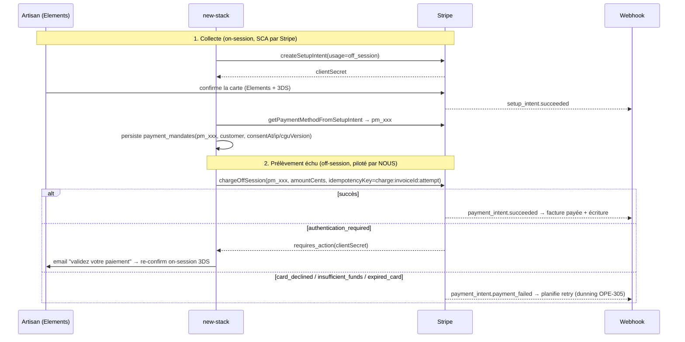

# OPE-303 — Spike : SetupIntent + prélèvement off-session piloté par nous

> Objectif : lever l'incertitude technique du cœur du projet — **collecter** un moyen de
> paiement (SetupIntent), puis **déclencher nous-mêmes** un `PaymentIntent` **off-session**
> fiable et conforme. Ce document fournit la **conception + le code de référence + un harnais
> de validation prêt à exécuter**.
>
> ⚠️ **Limite d'exécution honnête** : la validation chiffrée (taux de succès off-session, 3DS
> réel) exige des **clés Stripe test** et un appel réseau sandbox — non disponibles/non
> exécutés dans cet environnement (aucune clé, pas de réseau, et les opérations Stripe sont des
> effets de bord, cf. `stripe.ts:3`). Le PoC ci-dessous est **prêt à lancer** avec
> `STRIPE_SECRET_KEY` de test ; les résultats chiffrés restent **à produire** sur sandbox.
> Conclusion de faisabilité technique : **confirmée par construction** (API Stripe standard,
> et nous opérons déjà Checkout — `stripe-adapter.ts`), risques cantonnés aux parcours d'échec.

## 1. Ce qu'on prouve (5 points de l'issue)

1. **SetupIntent `usage: off_session`** → enregistre `PaymentMethod` + `customer`.
2. **Prélèvement** : `PaymentIntent` `off_session:true, confirm:true` sur le PM stocké.
3. **Échecs** : `authentication_required` (3DS off-session), `expired_card`, `insufficient_funds`.
4. **Idempotence** (`Idempotency-Key`) → pas de double prélèvement.
5. **Réconciliation** via webhooks `payment_intent.succeeded/failed`.

## 2. Extension du `StripePort` (proposée, non implémentée)

Le port actuel (`src/shared/ports/stripe.ts`) n'a **ni SetupIntent ni charge off-session ni
idempotence**. Ajouts ciblés :

```ts
// Ajouts à StripePort (conception OPE-303 / OPE-308)
export interface CreateSetupIntentParams {
  readonly customerId: string;            // customer existant ou créé en amont
  readonly metadata: Record<string, string>; // { artisanId }
}
export interface ChargeOffSessionParams {
  readonly customerId: string;
  readonly paymentMethodId: string;       // pm_xxx tokenisé (jamais de PAN — PCI SAQ-A)
  readonly amountCents: number;           // ENTIER, centimes (jamais float)
  readonly currency: "eur";
  readonly description: string;
  readonly idempotencyKey: string;        // = invoiceId maison (1 prélèvement / facture / tentative)
  readonly metadata: Record<string, string>; // { invoiceId, artisanId, attempt }
}
export type OffSessionOutcome =
  | { kind: "succeeded"; paymentIntentId: string }
  | { kind: "requires_action"; paymentIntentId: string; clientSecret: string } // 3DS → on-session
  | { kind: "failed"; code: string; declineCode: string | null };             // card_declined, expired_card…

export interface StripePort {
  // … méthodes existantes …
  createSetupIntent(p: CreateSetupIntentParams): Promise<{ id: string; clientSecret: string }>;
  getPaymentMethodFromSetupIntent(setupIntentId: string): Promise<{ paymentMethodId: string }>;
  chargeOffSession(p: ChargeOffSessionParams): Promise<OffSessionOutcome>;
}
```

## 3. Adapter de référence (mapping SDK)

```ts
// Dans StripeAdapter (src/shared/ports/stripe-adapter.ts) — étend le type StripeSDK
async createSetupIntent(p: CreateSetupIntentParams) {
  const s = await this.sdk();
  const si = await s.setupIntents.create({
    customer: p.customerId,
    usage: "off_session",            // ⇐ établit le mandat MIT
    payment_method_types: ["card"],
    metadata: p.metadata,
  });
  return { id: si.id, clientSecret: si.client_secret };
}

async chargeOffSession(p: ChargeOffSessionParams): Promise<OffSessionOutcome> {
  const s = await this.sdk();
  try {
    const pi = await s.paymentIntents.create({
      amount: p.amountCents, currency: p.currency, customer: p.customerId,
      payment_method: p.paymentMethodId,
      off_session: true, confirm: true,               // ⇐ MIT, sans interaction
      description: p.description, metadata: p.metadata,
    }, { idempotencyKey: p.idempotencyKey });          // ⇐ anti double-prélèvement
    return { kind: "succeeded", paymentIntentId: pi.id };
  } catch (e: any) {
    // Stripe lève sur off-session échoué ; l'erreur porte le PaymentIntent.
    const pi = e?.raw?.payment_intent;
    if (e?.code === "authentication_required" && pi) {
      return { kind: "requires_action", paymentIntentId: pi.id, clientSecret: pi.client_secret };
    }
    return { kind: "failed", code: e?.code ?? "unknown", declineCode: e?.decline_code ?? null };
  }
}
```

**Points clés**
- `idempotencyKey` = identité **métier stable** (ex. `charge:{invoiceId}:{attempt}`) : un rejeu
  réseau ne reprélève pas. Aujourd'hui **aucun** appel Stripe n'est idempotent (cf. OPE-300) —
  c'est une nouveauté structurante du moteur maison.
- Montant en **centimes entiers** (`amountCents`) — on abandonne le `Math.round(x*100)` sur
  float (`stripe-adapter.ts:78`) dans le chemin billing.
- `requires_action` n'est PAS un échec définitif : on bascule en **on-session** (le client
  re-confirme avec 3DS via le `clientSecret`). C'est le pont dunning↔SCA (OPE-305 §parcours).

## 4. Flux de bout en bout



## 5. Matrice des cas d'échec (cartes de test Stripe)

| Scénario | Carte test | Résultat attendu off-session | Action |
|---|---|---|---|
| Succès direct | `4242 4242 4242 4242` | `succeeded` | facture payée |
| 3DS requis off-session | `4000 0027 6000 3184` | `authentication_required` | relance on-session 3DS |
| Refus générique | `4000 0000 0000 0002` | `failed/card_declined` | retry planifié |
| Fonds insuffisants | `4000 0000 0000 9995` | `failed/insufficient_funds` | retry planifié |
| Carte expirée | `4000 0000 0000 0069` | `failed/expired_card` | demande mise à jour PM |
| Idempotence | rejouer la même `idempotencyKey` | **même** PaymentIntent, **0** double débit | — |

## 6. Harnais de validation (prêt à exécuter sur sandbox)

À placer en `scripts/poc/setupintent-offsession.ts`, lancé avec `STRIPE_SECRET_KEY` de test
(**hors `src/`** : c'est un PoC jetable, pas du code applicatif — cf. mission « ne rien coder »
dans `src/`). Squelette :

```ts
// 1) crée customer + SetupIntent ; confirme avec un PaymentMethod de test (pm_card_visa…)
// 2) chargeOffSession sur chaque carte de la matrice §5
// 3) rejoue l'idempotencyKey et assert: même PaymentIntent id
// 4) loggue {scenario, outcome.kind, code} → tableau de résultats
```

> Sortie attendue : un tableau scénario→résultat confirmant la matrice §5, **à produire** une
> fois les clés test fournies. C'est la seule étape non réalisable ici.

## 7. Conclusion (faisabilité)

- **Techniquement faisable, sans zone d'ombre majeure** : API Stripe standard (SetupIntent +
  PaymentIntent off-session/MIT), et nous opérons déjà l'adapter Stripe.
- **Trois exigences non négociables** introduites par ce chemin : **idempotence** (clé métier),
  **centimes entiers**, **gestion explicite de `requires_action`** (pont vers le dunning).
- **Reste à valider sur sandbox** (clés test) : les **taux** de succès/3DS réels et le
  comportement exact des `decline_code` — sans impact sur la décision d'architecture.
- Alimente **OPE-308** (impl. SetupIntent + mandat) et **OPE-302** (le off-session préserve
  PCI SAQ-A et l'exemption MIT).
